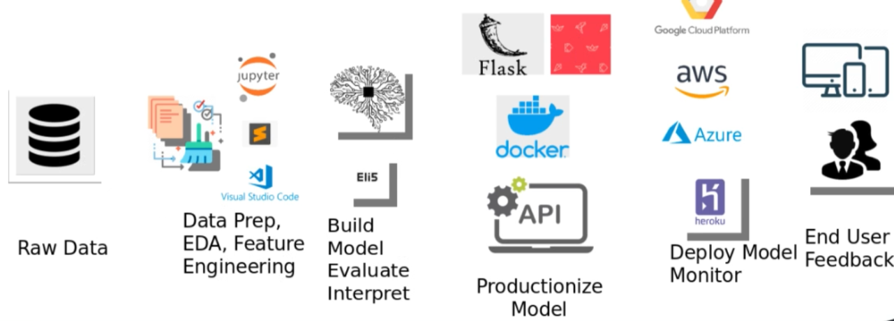

# Disease-Mortality-Predicition

### Hepatitis Mortality Predicition

In this project we built an end to end data science pipeline for Hepatitis mortality predicition from scratch. We present three machine learning models and do a comparitive analysis. We have outlined all the major insights at each step in the form of narratives. 

The entire process is productionized with the help of streamlit. We have built a complete machine learning web app using Streamlit and Python for Hepatitis Mortality Prediction. 

The steps followed for this project are clearly outlined below:

Dependencies:

* pandas
* numpy
* scikit-learn
* matplotlib
* seaborn
* joblib
* streamlit
* eli5

